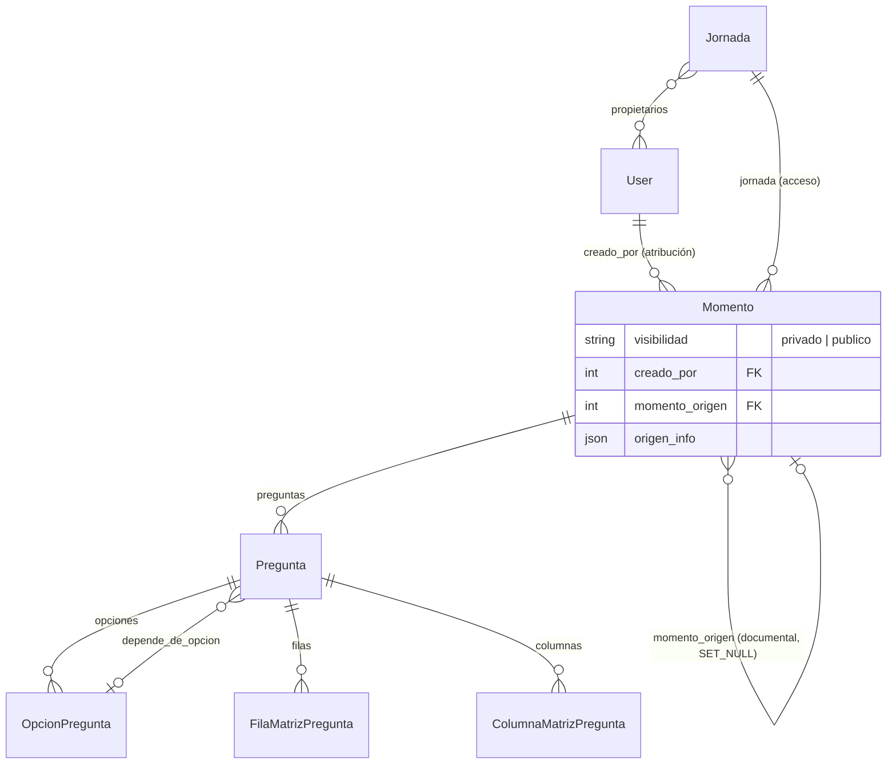

# 03 — Modelo de datos

Escrito bajo la recomendación **D1-A** (el momento es la plantilla). Si se elige D1-B, ver el
apéndice al final.

## 1. Cambios en `jornadas.Momento`

Cuatro campos nuevos. Ningún modelo nuevo.

```python
class Momento(models.Model):
    VISIBILIDAD_PRIVADO = 'privado'
    VISIBILIDAD_PUBLICO = 'publico'
    VISIBILIDAD_CHOICES = [
        (VISIBILIDAD_PRIVADO, 'Privado — solo yo puedo reutilizarlo'),
        (VISIBILIDAD_PUBLICO, 'Público — cualquiera puede usarlo como plantilla'),
    ]

    # ... campos existentes ...

    # Banco de instrumentos. Un momento SIEMPRE está en el banco: privado (solo lo reutilizan
    # los propietarios de su jornada) o público (cualquier usuario del panel). No hay estado
    # "fuera del banco": activo=False lo saca del listado por defecto (se ve con
    # ?incluir_inactivos=1) pero sigue siendo usable como plantilla (D12-B).
    visibilidad = models.CharField(
        max_length=10, choices=VISIBILIDAD_CHOICES, default=VISIBILIDAD_PRIVADO,
    )
    # Quién lo creó. Solo atribución (se muestra en el banco) — el acceso sigue yendo por
    # jornada.propietarios, igual que todo lo demás (D3/D4). SET_NULL: borrar un usuario no
    # borra sus momentos.
    creado_por = models.ForeignKey(
        settings.AUTH_USER_MODEL, on_delete=models.SET_NULL, null=True, blank=True,
        related_name='momentos_creados',
    )
    # De qué momento se copió, si se creó desde el banco. Relación puramente documental:
    # no restringe editar ni borrar ninguno de los dos lados. SET_NULL: si borran el
    # original, la copia sigue intacta y origen_info conserva el rastro.
    momento_origen = models.ForeignKey(
        'self', on_delete=models.SET_NULL, null=True, blank=True,
        related_name='momentos_derivados',
    )
    # Snapshot de identificación del origen al momento de copiar (D14). Sobrevive al borrado
    # del original. Vacío si el momento no salió del banco.
    origen_info = models.JSONField(default=dict, blank=True)
```

`origen_info` tiene esta forma fija:

```json
{
  "momento_id": 61,
  "titulo": "Diagnóstico de Articulación Académica",
  "jornada_id": 4,
  "jornada_slug": "jornada-agil-2026",
  "jornada_nombre": "Jornada Ágil 2026",
  "creado_por": "mgarcia",
  "copiado_en": "2026-09-18T15:04:00Z",
  "copiado_por": "jperez"
}
```

### Índices

- `visibilidad` entra en el filtro principal del banco: índice simple
  (`db_index=True`) o `Index(fields=['visibilidad', 'activo'])`.
- `momento_origen` ya indexa por ser FK.

### Lo que NO cambia

- `unique_together` de `Momento` se mantiene: la copia recibe `orden` calculado y `slug=''`.
- `Pregunta`, `OpcionPregunta`, `FilaMatrizPregunta`, `ColumnaMatrizPregunta`: sin cambios. Se
  copian con los mismos campos.
- `Jornada`: sin cambios.

## 2. Migraciones

`jornadas/0016_momento_banco.py` (esquema) + `jornadas/0017_momento_backfill_creado_por.py`
(datos), separadas para poder revertir el backfill sin tocar el esquema.

Backfill (D7-A):

```python
def backfill(apps, schema_editor):
    Momento = apps.get_model('jornadas', 'Momento')
    for momento in Momento.objects.select_related('jornada').iterator():
        if momento.jornada.creada_por_id:
            momento.creado_por_id = momento.jornada.creada_por_id
            momento.save(update_fields=['creado_por'])
```

`visibilidad` toma el default `privado` para todo lo existente (D6-A): tras desplegar, el banco
público está vacío hasta que alguien publique algo a propósito.

## 3. Diagrama



## 4. Semántica de la copia (servicio `copiar_momento`)

Módulo nuevo `jornadas/banco.py`:

```python
@transaction.atomic
def copiar_momento(origen, jornada_destino, usuario, *, orden=None, titulo=None,
                   visibilidad=Momento.VISIBILIDAD_PRIVADO) -> tuple[Momento, list[str]]:
    """Copia profunda de `origen` dentro de `jornada_destino`. Devuelve (copia, advertencias)."""
```

Pasos, en orden:

1. **Bloquear** la jornada destino (`select_for_update`) para calcular `orden = max(orden)+1`
   sin carrera entre dos copias simultáneas.
2. Crear el `Momento` copia con: `jornada=jornada_destino`, `orden`, `titulo` (el de origen
   salvo override), `slug=''` (para que `save()` lo regenere en la jornada destino),
   `contexto`, `tipo`, `categorias_semilla`, `mesas_permitidas`, `roles_permitidos`,
   `permite_carga_archivo`, `activo=True`, `visibilidad`, `creado_por=usuario`,
   `momento_origen=origen`, `origen_info={…}`.
3. Para **cada** `Pregunta` de origen, activa o no (D11-B), ordenadas por `orden`: crear la
   copia con los mismos campos (incluido `activa` tal cual) **excepto** `momento` (la copia) y
   `depende_de_opcion` (se deja `NULL` en esta pasada). Guardar
   `mapa_preguntas[id_origen] = copia`.
4. Para cada pregunta copiada: copiar `opciones`, `filas` y `columnas` conservando `texto` y
   `orden`. Guardar `mapa_opciones[id_origen] = copia`.
5. Segunda pasada para `depende_de_opcion` (D9-A): si la opción origen está en `mapa_opciones`
   → asignar la copia; si no → dejar `NULL` y agregar advertencia con el texto de la pregunta.
6. Advertencias de `roles_permitidos` (D10-A): unión de los roles del momento y de sus
   preguntas que no existan como `RolJornada.nombre` en la jornada destino.
7. Devolver `(copia, advertencias)`.

**Qué garantiza:** el original no se toca (solo lecturas); la copia no comparte ninguna fila con
el original; una falla a mitad de camino deja la base como estaba.

**Copiar dentro de la misma jornada** (duplicar) es el mismo código: `jornada_destino ==
origen.jornada`, `orden` va al final y `save()` resuelve el slug con sufijo `-2`.

## Apéndice — Deltas si se elige D1-B (snapshot en el banco)

Solo para dimensionar; no desarrollar.

- `Momento.jornada` pasa a `null=True`. Todo lo que hace `momento.jornada.x` sin comprobar
  (`__str__`, serializers de participante, analítica, extracciones) debe tolerar `None` o
  excluir `jornada__isnull=True` en sus querysets. Estimación: ~15 puntos de contacto.
- `orden` pasa a `null=True` (no tiene sentido sin jornada) y `save()` debe generar slug único
  **global** para las entradas del banco.
- Acciones nuevas: `publicar` (copia momento → banco), `republicar` (reemplaza el árbol del
  snapshot), y `usar` (copia banco → jornada). Tres copias profundas en vez de una.
- El servicio `copiar_momento` de arriba se reutiliza tal cual: la única diferencia es que
  `jornada_destino` puede ser `None`.
