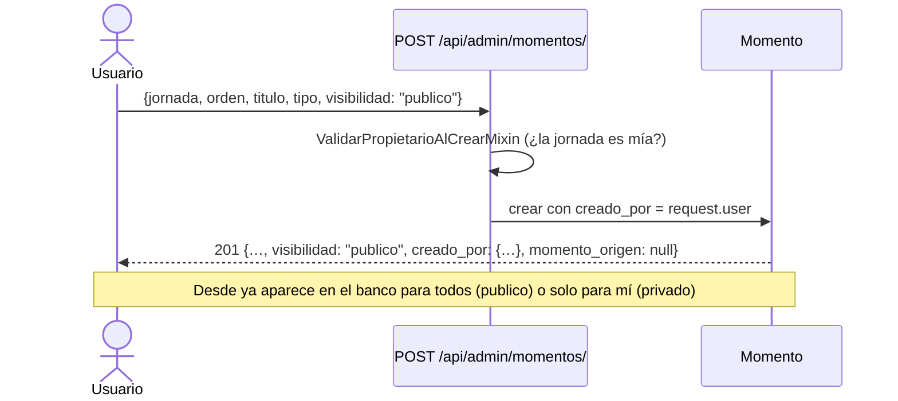
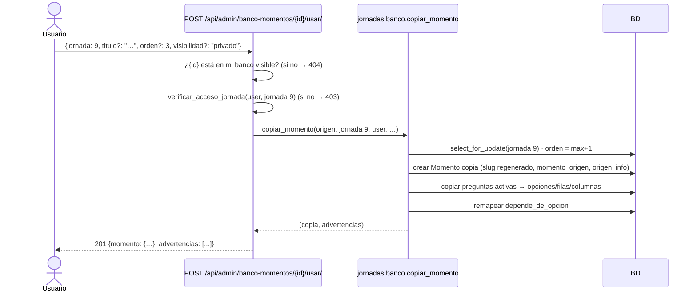

# 04 — Flujos, permisos y casos

Escrito bajo las recomendaciones de [02_decisiones.md](02_decisiones.md). Donde una decisión
cambia el comportamiento, se indica `(Dn)`.

## 1. Actores

| Actor | Quién es en el sistema | Qué puede hacer en el banco |
|---|---|---|
| **Usuario** (dependencia) | `User.is_staff=True` + `PerfilUsuario.rol='dependencia'` | Crear momentos en sus jornadas eligiendo visibilidad; ver públicos + los de sus jornadas; usar cualquiera de esos como plantilla en sus jornadas; editar solo los de sus jornadas. |
| **Administrador** | `is_staff=True` sin perfil, o `rol='admin'` | Todo lo anterior sobre cualquier jornada; ve también los privados de otros (D5). |
| **Participante** | `participantes.Participante` | Nada. El banco no existe en `/api/jornadas/**`. |

## 2. Flujos principales

### F1 — Crear un momento y definir su visibilidad



- `visibilidad` es opcional en el body; default `privado` (D6).
- `creado_por` lo pone el backend desde la sesión; si viene en el body se ignora.
- El árbol de preguntas se sigue creando con los endpoints de siempre (`/preguntas/`,
  `/opciones/`, …). Publicar no exige que el momento tenga preguntas.

### F2 — Publicar / despublicar un momento existente

`PATCH /api/admin/momentos/{id}/ {"visibilidad": "publico"}`. Misma regla de acceso que editar
(D4/D15). Cambiar de público a privado **no** afecta a las copias ya hechas por terceros: son
suyas.

### F3 — Explorar el banco

```mermaid
flowchart TD
    Q[GET /api/admin/banco-momentos/?q=&tipo=&alcance=] --> S{¿Quién pregunta?}
    S -->|dependencia| F1[publico=True ∪ jornada.propietarios ∋ yo]
    S -->|admin completo| F2[todos]
    F1 --> A[activo=True salvo ?incluir_inactivos=1]
    F2 --> A
    A --> R[Lista: id, titulo, tipo, visibilidad, creado_por, jornada, n_preguntas, veces_usado, puedo_editar]
    R --> D[GET /banco-momentos/{id}/ → árbol completo de preguntas, solo lectura]
```

- El listado es de **solo lectura**: no hay `POST/PATCH/DELETE` en `/banco-momentos/`.
- `alcance=publicos|mios|todos` (`todos` = públicos ∪ míos para dependencia; literalmente todos
  para admin).
- El detalle sirve para **previsualizar** antes de usar: trae `preguntas` con opciones, filas y
  columnas, igual que `MomentoAdminSerializer`, pero sin ids editables que tienten al FE a
  mandar un `PATCH`.

### F4 — Usar un instrumento del banco como plantilla



Después de esto el usuario edita la copia con los endpoints normales de momento/pregunta. El
original no se entera.

### F5 — Editar una plantilla (el original)

No hay flujo nuevo: es `PATCH /api/admin/momentos/{id}/` y los endpoints del árbol. Como las
copias son filas independientes, ninguna cambia. El campo `veces_usado` del banco le muestra al
dueño cuántas copias existen, por si quiere saber el alcance de lo que edita.

### F6 — Borrar una plantilla (el original)

`DELETE /api/admin/momentos/{id}/` como siempre. Las copias quedan con `momento_origen=NULL` y
conservan `origen_info` (D14). Nada bloquea el borrado.

### F7 — Ver de dónde salió un momento y qué salió de él

- En `GET /api/admin/momentos/{id}/`: `momento_origen` (id o null) y `origen_info`.
- En `GET /api/admin/banco-momentos/{id}/derivados/`: lista de momentos copiados de ese
  origen **que yo puedo ver** (mis jornadas; admin ve todos). Puramente informativo.

## 3. Matriz de permisos

`D` = usuario de dependencia, `A` = admin completo. "Mío" = momento de una jornada donde soy
propietario (D3-A).

| Acción | D sobre momento mío | D sobre momento público ajeno | D sobre momento privado ajeno | A sobre cualquiera |
|---|---|---|---|---|
| Verlo en el banco (lista/detalle) | ✅ | ✅ | ❌ 404 | ✅ |
| Usarlo como plantilla en jornada mía | ✅ | ✅ | ❌ 404 | ✅ |
| Usarlo como plantilla en jornada ajena | ❌ 403 | ❌ 403 | ❌ 404 | ✅ |
| Editar contenido (`PATCH /momentos/`, árbol) | ✅ | ❌ 404 | ❌ 404 | ✅ |
| Cambiar `visibilidad` | ✅ | ❌ 404 | ❌ 404 | ✅ |
| Borrar | ✅ | ❌ 404 | ❌ 404 | ✅ |
| Ver `derivados/` | ✅ (solo los que veo) | ✅ (solo los míos) | ❌ 404 | ✅ (todos) |

El 404 en vez de 403 para lo ajeno sigue la convención actual del proyecto (filtrado de
queryset): no revelar que el recurso existe.

## 4. Tabla exhaustiva de casos

### 4.1 Creación y visibilidad

| # | Caso | Comportamiento esperado |
|---|---|---|
| C01 | Crear momento sin `visibilidad` | Se crea `privado` (D6). |
| C02 | Crear momento con `visibilidad=publico` | Aparece de inmediato en el banco de todos. |
| C03 | Crear momento con `visibilidad` inválida (`"todos"`) | 400 `{"visibilidad": [...]}`. |
| C04 | Body incluye `creado_por` o `momento_origen` | Se ignoran (read-only); el backend los fija. |
| C05 | Dependencia crea momento en jornada ajena | 403 (comportamiento actual, sin cambio). |
| C06 | Publicar un momento sin preguntas | Permitido. El banco muestra `n_preguntas: 0`. |
| C07 | Publicar y luego volver a privado | Las copias existentes no cambian; deja de verse para terceros. |
| C08 | Poner `activo=False` a un momento público | Desaparece del listado por defecto del banco; sigue apareciendo con `?incluir_inactivos=1` y sigue siendo usable (D12-B). Las copias no cambian. |
| C09 | Momentos existentes tras la migración | Todos `privado`, `creado_por` = `jornada.creada_por` o null (D7). No aparece nada nuevo en el banco público. |

### 4.2 Exploración del banco

| # | Caso | Comportamiento esperado |
|---|---|---|
| B01 | Dependencia lista sin filtros | Públicos de cualquiera ∪ momentos de sus jornadas, `activo=True`, sin duplicados (`distinct`). |
| B02 | Admin lista sin filtros | Todos los `activo=True`, incluidos privados ajenos (D5). |
| B02b | Cualquiera lista con `?incluir_inactivos=1` | Igual que B01/B02 pero sin el filtro `activo=True`. |
| B03 | `?alcance=mios` | Solo momentos de jornadas donde soy propietario (cualquier visibilidad). |
| B04 | `?alcance=publicos` | Solo `visibilidad=publico` (incluye los míos públicos). |
| B05 | `?q=diagn` | `icontains` sobre `titulo` y `contexto`. |
| B06 | `?tipo=mesa` | Filtro exacto por tipo. |
| B07 | `?jornada=<id>` | Solo momentos de esa jornada (útil para "reutilizar todo lo de mi jornada anterior"). Si la jornada no es visible para mí y no es pública nada de ella → lista vacía. |
| B08 | `?solo_originales=1` | Excluye momentos con `momento_origen` no nulo, para no ver copias de copias. |
| B09 | Detalle de un privado ajeno por id | 404. |
| B10 | Detalle de un momento inactivo visible para mí | 200 (D12-B: el detalle no filtra por `activo`). El item trae `activo: false`. |
| B10b | `?incluir_inactivos=1` en el listado | Incluye momentos `activo=False`; sin el flag no aparecen. |
| B11 | Momento cuyo `creado_por` fue borrado | `creado_por: null` en la respuesta; se sigue listando. |
| B12 | Momento de jornada `activa=False` | Se lista igual (D12): las jornadas pasadas son la fuente principal de plantillas. |
| B13 | Orden del listado | `-actualizado_en` por defecto; `?ordering=titulo` opcional. |
| B14 | Paginación | La que use el proyecto por defecto (hoy sin paginación en los ViewSets admin). Se mantiene igual; si el banco crece, se agrega `PageNumberPagination` solo aquí. |
| B15 | Participante con token `Participant` llama al banco | 403 limpio (`IsAdminUser`), igual que cualquier `/api/admin/**`. |

### 4.3 Uso como plantilla (copia)

| # | Caso | Comportamiento esperado |
|---|---|---|
| U01 | Usar público ajeno en jornada mía | 201, copia completa, `momento_origen` = origen, `creado_por` = yo, `visibilidad=privado` (D8). |
| U02 | Usar el mismo público dos veces en la misma jornada | Dos copias, `orden` consecutivos, slugs `x` y `x-2`. |
| U03 | Usar mi propio momento en otra jornada mía | Igual que U01. |
| U04 | Usar mi propio momento en la **misma** jornada (duplicar) | Permitido; `orden = max+1`, slug con sufijo. |
| U05 | `jornada` en el body no es mía (dependencia) | 403 `"Esta jornada no te pertenece."` |
| U06 | `jornada` en el body no existe | 400 `{"jornada": ["Objeto inválido"]}`. |
| U07 | Origen privado ajeno | 404 (no está en mi banco). |
| U08 | Origen inactivo (visible para mí) | 201 (D12-B). La copia nace `activo=True`. |
| U09 | Body con `orden` explícito ya ocupado en destino | 400 `{"orden": ["Ya existe un momento con ese orden en la jornada."]}`. No se desplaza a los demás. |
| U10 | Body con `orden` explícito libre | Se respeta. |
| U11 | Body con `titulo` override | La copia usa ese título; el slug se genera a partir de él. |
| U12 | Body con `visibilidad=publico` | La copia nace pública. |
| U13 | Origen con preguntas `activa=False` | Se copian conservando `activa=False` (D11-B). |
| U14 | Origen con `depende_de_opcion` interna al momento (incluida una opción de pregunta inactiva) | Remapeada al id nuevo; la copia conserva la condicionalidad. |
| U15 | Origen con `depende_de_opcion` a opción de otro momento | Queda `NULL` + advertencia (D9). |
| U16 | *(absorbido por U14 tras D11-B)* | — |
| U17 | Origen con `roles_permitidos` que no existen en la jornada destino | Se copian tal cual + advertencia listando los roles (D10). |
| U18 | Origen con `mesas_permitidas` | Se copian tal cual, sin advertencia (los números de mesa no tienen catálogo). |
| U19 | Origen tipo `mesa` con `filas_adicionales` / tipo `lista` | Se copian los flags; no hay `FilaListaRespuesta` porque son ejecución. |
| U20 | Origen con `permite_carga_archivo=True` | Se copia `True`. El destino decide si lo apaga. |
| U21 | Origen con respuestas, extracciones, análisis IA, infografías | **Nada** de eso se copia. La copia nace sin datos de ejecución. |
| U22 | Dos usuarios copian a la misma jornada al mismo tiempo | `select_for_update` sobre la jornada serializa; ambos obtienen `orden` distinto. |
| U23 | Falla a mitad de la copia (p. ej. error de BD) | `transaction.atomic` revierte todo; 500 sin momento a medias. |
| U24 | Origen con 0 preguntas | 201 con la copia vacía. |
| U25 | Copiar una copia (nieto) | Permitido. `momento_origen` apunta a la copia intermedia, no al abuelo. `origen_info` describe la copia intermedia. |
| U26 | Admin usa un privado ajeno en una jornada de un tercero | Permitido (D5). `creado_por` = el admin. |
| U27 | Después de copiar, editar la copia | Solo cambia la copia. El original y las demás copias no se tocan. |
| U28 | Después de copiar, editar el original | Solo cambia el original. |
| U29 | Después de copiar, borrar el original | La copia queda con `momento_origen=null`, `origen_info` intacto. |
| U30 | Después de copiar, borrar la jornada origen | Igual que U29 (CASCADE borra el original → SET_NULL en la copia). |
| U31 | Después de copiar, borrar la copia | El original no se entera; `veces_usado` baja en uno. |
| U32 | Tamaño grande (90 preguntas con matrices) | Copia en una transacción con `bulk_create` por nivel; debe responder en < 2 s. |

### 4.4 Trazabilidad

| # | Caso | Comportamiento esperado |
|---|---|---|
| T01 | `GET /momentos/{id}/` de una copia | Incluye `momento_origen: <id>` y `origen_info: {…}`. |
| T02 | `GET /momentos/{id}/` de un momento "desde cero" | `momento_origen: null`, `origen_info: {}`. |
| T03 | `GET /banco-momentos/{id}/derivados/` como dependencia | Solo derivados en mis jornadas. |
| T04 | `GET /banco-momentos/{id}/derivados/` como admin | Todos los derivados. |
| T05 | `veces_usado` en el listado | `COUNT(momentos_derivados)` total (no filtrado por visibilidad): al dueño le interesa el número real. |

## 5. Lo que el participante ve

Nada cambia en `/api/jornadas/**`. Una copia es un momento normal de la jornada destino: se
lista, se responde, se transcribe y se analiza igual que cualquier otro. Los campos
`visibilidad`, `creado_por`, `momento_origen` y `origen_info` **no** se exponen en los
serializers de participante.
