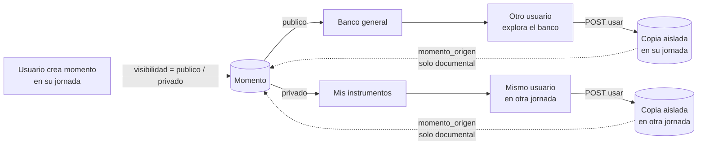

# Banco de instrumentos (plantillas de momentos) — plan de desarrollo

> **Estado: propuesta, pendiente de decisiones.** Nada de esto está implementado. Antes de tocar
> código hay que cerrar las decisiones marcadas como **bloqueantes** en
> [02_decisiones.md](02_decisiones.md).

## Qué es

Un **instrumento** es, en este contexto, un **momento** de una jornada (`jornadas.Momento` con su
árbol de preguntas, opciones, filas y columnas). El banco de instrumentos permite:

- Al crear un momento, decidir si es **público** (cualquier usuario del panel puede usarlo como
  plantilla) o **privado** (solo su creador puede reutilizarlo en otras jornadas).
- Explorar el banco y **usar** un instrumento como plantilla: se crea una **copia** completa en la
  jornada del usuario, nunca se usa el original directamente.
- Las copias quedan **aisladas**: editar el original no cambia las copias, ni al revés.
- Entre original y copia queda una relación **documental**: se sabe de dónde salió cada momento,
  pero esa relación no restringe nada (se puede borrar el original, editar la copia, etc.).
- Solo el **creador** del instrumento y un **administrador** pueden modificarlo.
- Un usuario puede usar **varios** instrumentos en una misma jornada y reutilizar los suyos
  **tantas veces** como quiera.

## Documentos

| Archivo | Contenido |
|---|---|
| [01_contexto.md](01_contexto.md) | Qué existe hoy en el código que condiciona el diseño (modelos, scoping, constraints). |
| [02_decisiones.md](02_decisiones.md) | **Decisiones y preguntas abiertas**, cada una con opciones, recomendación y si bloquea o no. |
| [03_modelo_de_datos.md](03_modelo_de_datos.md) | Cambios en `Momento`, migración, backfill, diagrama. |
| [04_flujos_y_casos.md](04_flujos_y_casos.md) | Flujos de usuario, diagramas, matriz de permisos y **tabla exhaustiva de casos** (incluidos los borde). |
| [05_api.md](05_api.md) | Endpoints nuevos y modificados, payloads, respuestas y códigos de error. |
| [06_plan_de_desarrollo.md](06_plan_de_desarrollo.md) | Fases, tareas, archivos a tocar, tests, HU a documentar y riesgos. |

## Resumen de la propuesta (en una pantalla)

La recomendación central es **no crear un modelo aparte de plantillas**: el propio `Momento` es la
plantilla y el banco es una *vista filtrada* de los momentos existentes (`visibilidad=publico` o
"míos"). Eso reutiliza el árbol de preguntas tal cual, no duplica cuatro modelos, y hace que
"publicar" sea cambiar un campo. El costo es que la plantilla vive atada a su jornada; los
detalles y la alternativa (snapshot con `jornada=NULL`) están en la decisión **D1**.

## Numeración de HU reservada

Última HU existente: **HU-66**. Este feature ocupará **HU-67 a HU-70** (ver
[06_plan_de_desarrollo.md](06_plan_de_desarrollo.md)); se documentan en
`docs/USER_STORIES_COMPLETO.md` al cerrar cada fase, más una guía
`docs/INTEGRACION_FRONTEND_BANCO_INSTRUMENTOS.md`.
