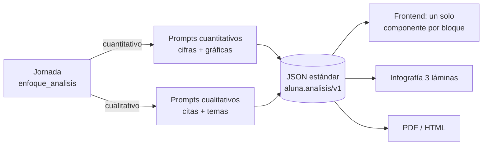

# Enfoque de análisis por jornada (cuantitativo / cualitativo) — plan de desarrollo

> **Estado: plan redactado el 2026-09-19, decisiones pendientes de cierre.** Las decisiones
> abiertas están en [01_plan_de_desarrollo.md](01_plan_de_desarrollo.md) §2; cuando se cierren,
> ese documento es la fuente de verdad del avance por fase.

## Qué es

Hoy toda jornada se analiza como si fuera un **instrumento con datos cuantitativos**: preguntas
con conteos, porcentajes, gráficas de pastel/barras/radar, tasa de participación. Eso es correcto
para una jornada de encuestas o de cuestionarios por mesa, pero hay otro tipo de jornada — la de
**percepción general** — donde lo que se recoge son **diálogos**: transcripciones de conferencias,
intervenciones en plenaria, conversatorios, entrevistas. Ahí no hay nada que contar: forzar cifras
produce hallazgos con "3 de 7 menciones" que no significan nada, láminas con gráficos de dos
barras y un resumen ejecutivo que habla de porcentajes de un material que nunca fue una muestra.

Este cambio agrega a la jornada un **enfoque de análisis** que se decide al crearla (y se puede
cambiar después):

| Enfoque | Qué recoge la jornada | Qué produce el análisis |
|---|---|---|
| `cuantitativo` (**default**, todo lo que existe hoy) | Instrumentos individuales o por mesa: opciones, escalas, matrices, abiertas | Hallazgos con cifras exactas y gráficas; infografía con participación y visualizaciones |
| `cualitativo` (percepción general) | Diálogos: transcripciones, intervenciones, respuestas abiertas de conversatorio | Hallazgos en prosa respaldados por **citas textuales**, temas, tensiones y consensos; **cero cifras, cero gráficas** en reportes e infografías |

El enfoque cambia **todos** los system prompts que producen reportes o infografías (8 puntos de
prompt en 5 módulos, ver [01_plan_de_desarrollo.md](01_plan_de_desarrollo.md) §1), y aprovecha
para **estandarizar el JSON de salida** de todas las vías de análisis con IA en un único
contrato (`aluna.analisis/v1`) que el frontend renderiza con un solo componente, sabiendo qué es
cada bloque y cómo pintarlo — hay o no hay gráfica, hay o no hay citas — sin adivinar por la
forma del objeto.

## Documentos

| Archivo | Contenido |
|---|---|
| [01_plan_de_desarrollo.md](01_plan_de_desarrollo.md) | Inventario de prompts y renderizadores afectados, **decisiones**, modelo de datos, API, fases con tareas/tests/HU, riesgos. |
| [02_system_prompts.md](02_system_prompts.md) | **Todos los system prompts**, en su variante cuantitativa y cualitativa, listos para copiar al código. |
| [03_formato_salida_estandar.md](03_formato_salida_estandar.md) | El contrato JSON `aluna.analisis/v1`: campos, invariantes por enfoque, tabla "qué es cada cosa y cómo se renderiza", ejemplos completos. **Es el documento que se pasa al frontend.** |

## Resumen en una pantalla

Lo que **no** cambia: el modelo de imágenes, el pipeline de mapa-reducción de transcripciones,
la carga de assets/system design, el scoping por propietario, los endpoints existentes (solo se
agregan campos y un valor por defecto que reproduce exactamente el comportamiento actual).
